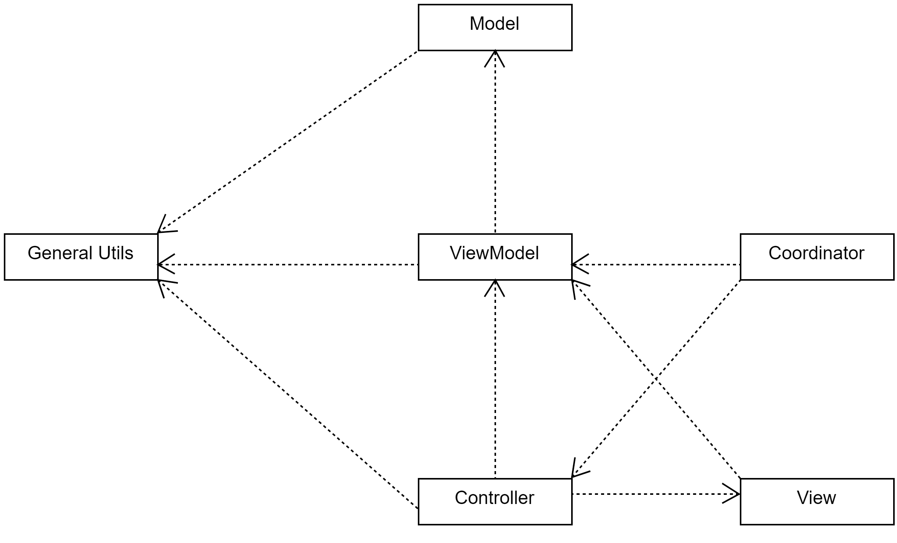
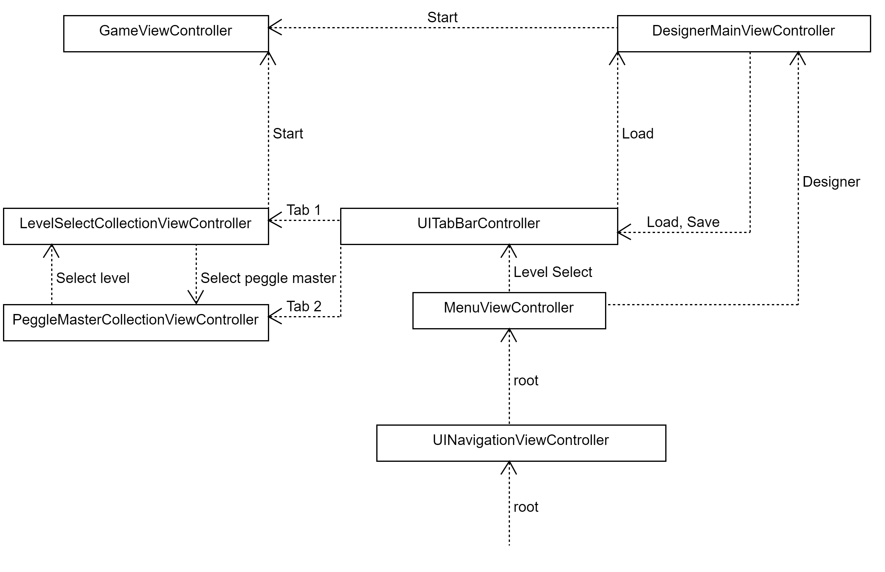
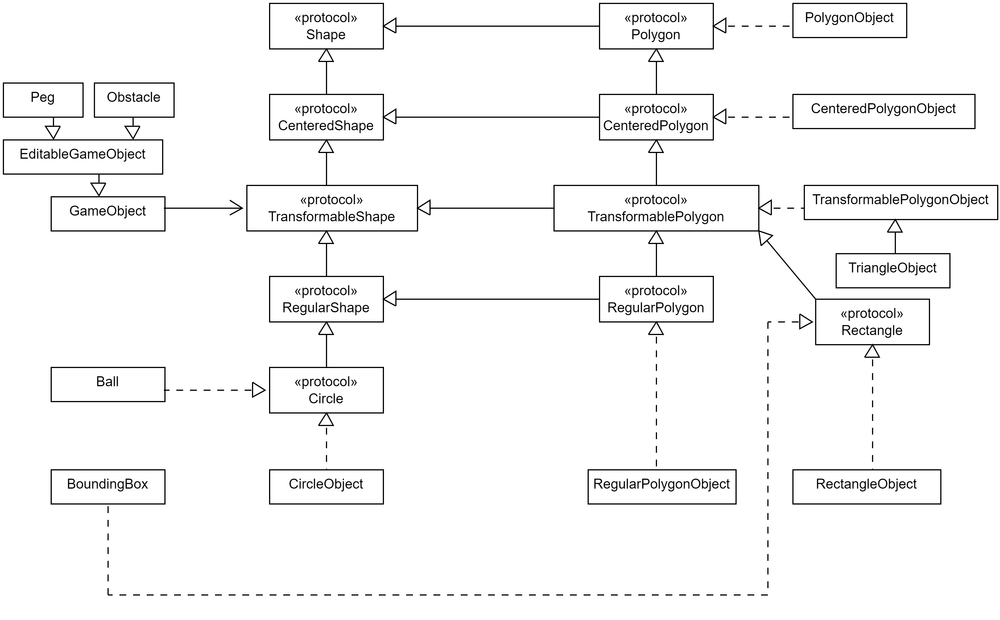
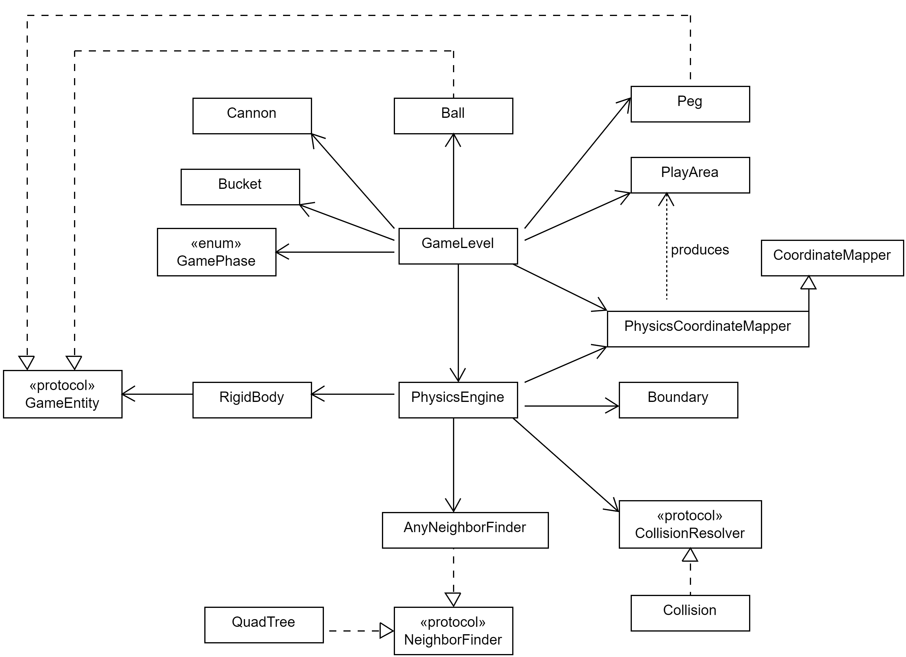
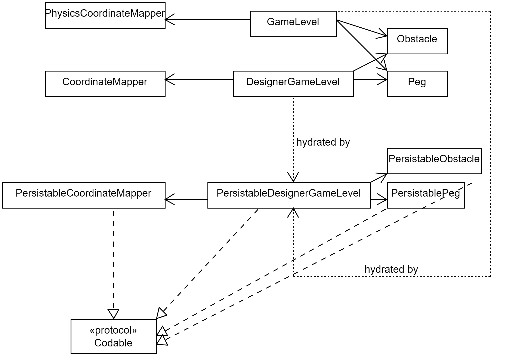

# CS3217 Problem Set 4

**Name:** Sun Jia Cheng

**Matric No:** A0214263N

## Tips
1. CS3217's docs is at https://cs3217.github.io/cs3217-docs. Do visit the docs often, as
   it contains all things relevant to CS3217.
2. A Swiftlint configuration file is provided for you. It is recommended for you
   to use Swiftlint and follow this configuration. We opted in all rules and
   then slowly removed some rules we found unwieldy; as such, if you discover
   any rule that you think should be added/removed, do notify the teaching staff
   and we will consider changing it!

   In addition, keep in mind that, ultimately, this tool is only a guideline;
   some exceptions may be made as long as code quality is not compromised.
3. Do not burn out. Have fun!

## Important
This git repository uses `git-lfs` for storing uncompressed `.wav` files. (Ideally I would use it to store mp3 and png files as well, but that requires a repo cleaner to remove these files from git. In view of the risks, I decided not to do it.)
The installation is [here](https://git-lfs.github.com/).

## Credits
This game is a tribute to one of the greatest visual novels of all time, Umineko When They Cry.
- [Ryukishi07](https://07th-expansion.fandom.com/wiki/Ryukishi07) and [07th Expansion](https://07th-expansion.fandom.com/wiki/07th_Expansion) for allowing me, a Reader, to traverse the Sea of Fragments
- The [Fandom wiki](https://07th-expansion.fandom.com/wiki/07th_Expansion_Wiki) for character sprites. These sprites are also available from the novel files (the Steam version requires 07th mod for the Playstation 3 sprites).
- [Youtube video](https://www.youtube.com/watch?v=k4T8HeK-ZIg) for Bernkastel's encouragement
- [Youtube video](https://www.youtube.com/watch?v=Tu14bVETMLw) for the congratulations of various characters. The actual audio comes from the fighting game spin-off Golden Fantasia. It is not possible to directly extract the audio from the game files themselves as the game files use an unknown binary encoding.
- [http://jwgrlrrajn.github.io/SFX/Umineko/index.html](http://jwgrlrrajn.github.io/SFX/Umineko/index.html) for some of the sound effects
- Other sound effects come directly from Umineko files

## Dev Guide
### Overview
This application uses a mix of MVVM and MVC, as well as the Coordinator pattern. For the most part, MVVM is used, other than relatively simple components that don't require a view model. 

**General utilities**
- Provide generic storage and logging services for the other components.

**Coordinators**
- Manage view transitions. Instantiate controllers and inject them with view models.
  
**Controllers**
- Depend on view models for domain logic and state.
- Manipulate views.

**Views**
- Depend on view models for state.

**View models**
- Manipulate models.

**Models**
- Contain all the core domain logic.

### General utilities
Next, we go one step deeper. Let's explore the general utilities which don't depend on other parts of the application first.

General utilities consist of 2 main classes, `LoggerWrapper` and `Storage`. There is also `JSONStorage` that is a specialization of `Storage`.

#### Storage
- `Storage` handles reading and writing of files to local storage.
- `JSONStorage` specializes in handling JSON data, and is also equipped with encoding and decoding facilities. Of course, `JSONStorage` can only encode objects conforming to the `Encodable` protocol and decode objects conforming to the `Decodable` protocol.
- `Storage` is used by view models when loading and saving game levels created by the level designer.
#### LoggerWrapper
- `LoggerWrapper` is a friendly wrapper around the `Logger` class in the `os` module and provides conditional logging depending on the currently set `logLevel`. 
- `LoggerWrapper` is used by any class that requires logging.

With the general utilities covered, we can move on to the core business logic of PeggleClone.

#### Audio
- `Audio` is responsible for setting up the audio session and creating instances of `AVAudioPlayer` using stored audio files in the bundle.
- It also provides a global object `globalAudio` since the audio session should only be setup once, so multiple instantiations of `Audio` may cause issues.

### Coordinator

The diagrams shows the flow of views. The root view is a `NavigationViewController` and transitions to views take the form of pushing them onto the navigation stack by `AppCoordinator`. When views are dismissed, they are popped from the stack.

The root view of the `NavigationalViewController` is the menu, where the player can choose between selecting a level to play as well as a peggle master, or going straight into the level designer.

### Models
We cover the revised shape hierarchy. The `XXXShape` and `XXXPolygon` protocol chain appears to be parallel, while in some environments it may be deemed as an anti-pattern, it does not cause any issues in this application, and in fact makes things more explicit.

- A `Shape` can be considered as any connected 2D object.
- A `CenteredShape` is a shape with a defined center. For the purposes of this application, we can reasonably assume that this center refers to the center of mass. (Although this assumption might cause limitations if we want to rotate a shape about an arbitrary pivot.)
- A `TransformableShape` is a centered shape that can accept the affine transformations of rotation and scaling. Translation can be simulated by moving the center of a shape; the rest of the shape moves along with the center. 
- A `Polygon` is a shape with a finite number of edges, in particular, it must have at least 3 edges (a triangle). `CenteredPolygon` and `TransformablePolygon` are similar to `CenteredShape` and `TransformableShape`, with the addition of the polygonal nature of the shape.
- A `RegularPolygon` is a convenient subtype of a `TransformablePolygon`. This is because we only to know the "radius" of a regular shape to know where its vertices are.
By convention, the default position of the $i$-th vertex of a regular shape with $n$ sides is at
$$
(r\cdot \cos \frac{2\pi i}{n},r\cdot \sin \frac{2\pi i}{n}),\quad i = 0,1,\dots,n-1
$$
in Cartesian coordinates.
This is easily generalizable to $(r\cdot \cos(\frac{2\pi i}{n} + \theta),r\cdot \sin(\frac{2\pi i}{n} + \theta))$ for some $\theta$ by doing a rotation on the shape.

`XXXObject` are class-implementations of the various protocols. For the game engine objects, only `CircleObject`, `TriangleObject` and `TransformablePolygonObject` are used, since these cover all the shapes we need for Peggle. Of course, this excludes shapes like non-circular ellipses, but we will not cover those.

Note that `TriangleObject` is a subclass of `TransformablePolygonObject`. It is mainly used for `Obstacle`, which is restricted to triangular shape. The reason is that the vertices of an `Obstacle` can be freely moved around, and if a polygon has more than 3 sides, it is not trivial to ensure that the shape remains convex. A triangle, on the other hand, is always convex.

##### The coordinate system
The coordinate system is a mixture of cartesian coordinates and polar coordinates.
The position of a shape is given by its center, which uses cartesian coordinates.
The vertices of a shape are relative to the shape's center, these use polar coordinates, with the origin being the center of the peg. The pro of using polar coordinates is that they make certain transformations like rotation and scaling trivial to perform.

Next, we examine the actual game objects. Note that the shape hierarchy provides the geometrical properties associated with each game object.

- `GameEntity` is the high level protocol that all game objects conform to.
- `EditableGameEntity` are game entities that can be edited in the level designer. For example, the ball is not editable since it is not part of the level design.
- `GameObject` is a pseudo-abstract class that abstracts out the main functionalities associated with peg, obstacle, etc.
- `EditableGameObject` adds on the properties required by `EditableGameEntity` to `GameObject`
- `Ball` is the ball that is shot from the cannon.
- `Peg`s are any destructible objects (by the ball).
- `Obstacle`s are indestructible objects. Obstacles can still be potentially forcibly removed if the ball gets stuck.
- `Bucket` is not editable since it does not appear in the level designer. A bucket is a composite of 3 game objects, i.e. the left side, the right side, and the receiver that receives a ball to grant a free ball.

The game level is split into 2 major models. The first is the `DesignerGameLevel`, which represents the state of the level being designed on the level designer. The second is `GameLevel`, which represents the state of the level when the game is actually being played.

#### DesignerGameLevel

`DesignerGameLevel` has a number of dependencies. The main dependencies are:

##### CoordinateMapper
There are 3 types of coordinates in this application. They are:
- Logical coordinates: The coordinates that the core logic works with.
- Screen coordinates: The displayed pixel coordinates.
- Physical coordinates: "Real world" coordinates. This is only relevant for the game, and is only really used by the physics engine. In fact, the physics engine takes in a `PhysicsCoordinateMapper` object, which is a subclass of `CoordinateMapper` to transform any physical coordinates (such as acceleration due to gravity $g$) into logical coordinates before performing computations.

The base `CoordinateMapper` class only handles conversion between logical and screen coordinates.
Logical coordinates are of the following form. Upon creation of a level, $\text{aspect ratio} = \frac{\text{screen width}}{\text{screen height}}$. After this computation, the logical coordinate space is then described by
$$
[0, \text{aspect ratio}] \times [0, \text{logical height}]
$$
where logical height is at least 1.
In other words, the y-component of the logical coordinate space is always in $[0, \text{logical height}]\supseteq [0, 1]$.
The actual display dimensions are then a scaled-up version of the logical coordinate space. The application scales this as large as possible without exceeding either screen width or screen height.

With the addition of scrolling, there are 2 notions of display dimensions.
1. Viewable display area **on screen**, i.e. the ScrollView
2. Backing display area which is a child view of the ScrollView.
$[0, \text{aspect ratio}] \times [0, 1]$ maps to the first in some sense. By this, I mean that the unit interval in logical coordinate space corresponds to the on screen view.
$[0, \text{aspect ratio}] \times [0, \text{logical height}]$ maps to the second.
##### PlayArea
The play area represents the big rectangular box that the game takes place in. Everything (pegs and obstacles) must be wholly contained within the play area.

##### Container
The container manages the collection of entities in the level. Ideally, the container would provide fast membership testing.

##### CollisionDetector
The collision detector detects collisions between entities.
##### NeighborFinder
The neighbor finder participates in the broad-sweep portion of collision detection, where a number of candidates are found to be potentially colliding. Each candidate is then checked specifically using an accurate collision detection algorithm (provided by the collision resolver).

##### Dependency injection
For testability, many of these dependencies are stated as protocols to be conformed to by some implementing class, and these dependencies are then passed to `DesignerGameLevel`'s constructor explicitly, allowing for *dependency injection*.
The `AnyXXX` classes such as `AnyNeighborFinder` and `AnyContainer` are used for type erasure. This is due to the limitations Swift places on protocols.
Protocols cannot conform to another protocol. In other words, if I widen an object `a` of say, type `A: ProtocolA` to `ProtocolA`, then I cannot use `a` as a parameter in any function expecting `ProtocolA`.
These restrictions are even more troublesome when it comes to protocols with associated types like `Container`. It is not possible to even have a class member with a protocol type `Container<Element>`. It must be a concrete type(such as `AnyContainer<Element>`).

In practice, the default implementations of each protocol is as follows:
- `Container`: `SetObject`, which is wrapper around `Set`. Note that this is necessary due to difficulties in getting `Set` (which is a value-type) to be added to the type-erased `AnyContainer`.
- `CollisionDetector`: `Collision`, which has both collision detection and collision resolution abilities.
- `NeighborFinder`: `QuadTree`, which is a data structure that splits 2D space into quarters.

**Remark** When examining the `Collision` class, it may seem that the collision detection methods are similar to the collision resolution methods. Indeed, collision detection is essentially a lower-powered version of collision resolution. For performance reasons, I chose to split them apart. 
#### GameLevel

Somewhat unlike `DesignerGameLevel`, `GameLevel` only one main dependency, the `PhysicsEngine`. This is because all logic concerning geometry, collisions etc. are delegated to the physics engine.

The enumeration `GamePhase` models the state of the game is in. Read the in-code documentation for a summary of the game states.

The `PhysicsEngine` has these dependencies:
- `RigidBody` contains an assortment of properties that are used to perform physics calculations.
- The `RigidBody` has a convenience reference back to the `GameEntity` it is associated with, allowing the physics engine to communicate with the game level, which can be interpreted as the game engine. 
- `Boundary` represents the physical world of the game. It is rectangular, and each rigid object can have customized behavior when it collides with an edge of the boundary.

The `WallBehavior` enumeration (See `Boundary.swift`)  dictates how a rigid body ought to behave upon colliding with an edge of the boundary.
1. `fallThrough`: The body "passes through" the edge without any interaction, and when the body is completely outside the boundary, it is marked for deletion.
2. `collide`: Just as what you would expect, the body will bounce off the wall.
3. `wrapAround`: The body "wraps around" to the opposite side of the boundary. For example, if the body moves completely outside the left wall, and its left wall behavior is marked as wrapAround, then the body will be teleported to the right wall, keeping its previous velocity.

The rigid body has multiple sub-components. In a previous version of this project, many of these properties are flat, and not organized into these sub-objects.

- `PhysicsEngineReports` is used by the physics engine to suggest changes to the rigid body to the game engine, and it is up to the game engine to decide whether to commit or discard these changes to the rigid body. Additionally, the game engine may even conduct some other game specific logic when it examines these suggestions.
- `PhysicalProperties` consist of the most essential properties of a physics object. Most notably, the position of the rigid body (i.e. `backingShape.center`) is stored here.
- `LongTermDelta` consists of potentially long-lasting properties that can be used to effect change on the physical properties. By long-lasting, I mean that they can last longer than one physics update.
- `InstantaneousDelta` consists of short-lasting properties that can effect change over 1 physics update. After the physics update, the instantaneous delta is reset, e.g. `nextTeleportLocation` is set to nil, `force` and other vector quantities are set to zero.
- `ConfigurationForPhysicsEngine` are flags for the physics engine to narrow down what rigid bodies to update, and how to suggest updates for them. For example, without the `canTranslate` or `canRotate` tag, the physics engine would need to go over every single physics object to be safe. So these are mainly used for efficiency reasons.
- `MiscProperties` are other properties less relevant to physics, but are still useful information for the game engine.

We next examine the various properties on a `RigidBody` (and its subcomponents) and how they affect it. Not listed here are also some computed properties on `RigidBodyObject` that essentially come from the underlying `backingShape`.

- `associatedEntity: GameEntity?`: Used to communicate with the game engine. When passing a rigidbody back to the game engine, this field allows the game engine to find out which game entity is associated with the rigid body, and apply the corresponding game logic.
- `sides: Int`: The number of sides of the underlying shape. 0 if the shape is a circle.

##### PhysicsEngineReports
- `teleports: [Teleport]`: Teleports on the rigid body suggested by the physics engine.
- `forces: [Force]`: Forces suggested.
- `impulses: [Impulse]`: Impulses suggested.
- `collisionDetected: Bool`: Whether a collision is detected by the physics engine. Whether this collision is to be registered is still up to the game engine's discretion.
##### PhysicalProperties
- `backingShape: TransformableShape`: The underlying geometrical shape of the rigidbody. Notice that the rigidbody does not care about what the game object is, be it a `Peg`, `Ball` etc. Only the shape can possibly affect its physical properties.
- `uniformDensity: Double`: The density uniform across a rigidbody. Clearly, simulating varying density is far beyond a simple physics engine.
- `mass: Double`: Physics concept. Defaults to the area of the underlying shape scaled by the uniform density.
- `inverseMass: Double`: The reciprocal of mass.
- `momentOfInertia: Double`: Physics concept. The rotational equivalent of mass. Defaults to the moment of area (see wikipedia) of the underlying shape scaled by the uniform density.
  - **Remark**: In the implementation, this quantity is multipled by `Settings.easeOfRotation.rawValue` in order to possibly make pegs more easy to rotate. This is because the moment of inertia is dependent on shape area, and without this artificial scaling factor, the ball is too small to apply sufficient force on a large peg to make it spin. 
- `inverseMomentOfInertia: Double`: The reciprocal of moment of inertia.
- `elasticity: Double`: Determines how much energy is lost by a rigidbody upon collision.

##### LongTermDelta
- `linearVelocity: CGVector`: Physics concept.
- `angularVelocity: Double`: Physics concept. The rotational equivalent of linear veloicty.
- `persistentForces: [Force]`: Long lasting forces that act on the rigid body.
##### InstantaneousDelta
- `nextTeleportLocation: CGPoint?`: Allows the physics engine to teleport a rigidbody in an update.
- `force: CGVector`: Physics concept.
- `impulseIgnoringForce: CGVector`: Physics concept. Impulse is the change in momentum, and is the result of force applied over time. This particular quantity, however, acts as "instanteneous impulse", and ignores force. See "impulse-based physics engines" for more details.
- `torque: Double`: Physics concept. The rotational equivalent of force.
- `angularImpulseIgnoringTorque: Double`: Physics concept.
- `changeToWrapAroundCount: CounterChange`: Whether to increment, reset or make no changes to the wrap around count.
- `shouldDelete`: Whether the rigid body should be deleted.
##### ConfigurationForPhysicsEngine
- `canTranslate: Bool`: This property overrides mass. Determines whether an object can actually translate, regardless of its mass.
- `canRotate: Bool`: This property overrides moment of inertia. Determines whether an object can actually rotate, regardless of its moment of inertia.
- `leftWallBehavior, rightWallBehavior, topWallBehavior, bottomWallBehavior: WallBehavior`: This has been explained above.

##### MiscProperties
- `consecutiveCollisionCount: Int`: The number of consecutive physics engine updates for which a collision is detected. Used by the game engine to detect if objects are stuck.
- `wrapAroundCount: Int`: The number of times for which a physics object has wrapped around the game boundary.

#### Persistence
Before moving on to more details about the game level, we first discuss the persistence models, since we have already covered the `DesignerGameLevel` and `GameLevel`.

Only 4 models are Codable, and persisted, `PersistableCoordinateMapper`, `PersistableObstacle`, `PersistablePeg` and `PersistableDesignerGameLevel`. They are stripped down versions of the regular models. Note that `PlayArea` does not need to be persisted, since the coordinate mapper has all the required information to produce the playarea when hydrating a game level.

The most notable part is that both `DesignerGameLevel` and `GameLevel` are hydrated by the `PersistableDesignerGameLevel`. In other words,
- When a designed game level is saved, it is converted to `PersistableDesignerGameLevel`
- When transitioning into the designer view, the information available in `PersistableDesignerGameLevel` is injected into the `DesignerGameLevel`, and the view is then updated accordingly.
- When transitioning into the game view, similarly the game view gets its information from `PersistableDesignerGameLevel`.
- Hydration is the **only** way pegs, obstacles are added to a blank level. The constructor of `DesignerGameLevel` and `GameLevel` in fact do not allow filled peg containers to be provided. They only accept empty containers. The reason is that the process of adding new game objects needs to be reflected on screen, and at the initialization stage, the view controller callbacks have not been registered in the model.

**Remark** Due to the nature of the hydration, which takes place after a controller's `viewDidAppear` lifecycle phase, the loading process can be quite obvious, especially on iOS simulators. i.e. You can see the pegs popping into view. There may be better ways to do this, like add in a loading spinner, but I think I may not do that due to time reasons.

#### Game Loop
Before going into the main game loop, we take a loop at a sequence diagram of the initialization process of the game level and associated controllers and view models. 

The `appCoordinator`, in its `showGame` method, instantiates a `GameViewController` and later pushes it into the navigational stack of the `navigationViewController`.
But before that, the `appCoordinator` has to prepare data for the `gameViewController`. And to do this, the associated view model, an instance of `GameViewModel` is created and injected into `gameViewController` as a property.

On `viewDidLoad`, one of the most important things done by the `gameViewController` is to create the display link, and instructs its view model to start a new game of Peggle.

This is a relatively high level overview of the game loop. To avoid seeing the forest for the trees, some details are left out, such as
- Game phase: We assume that the game is currently in the `.ongoing` phase. The code itself has more documentation about the various game phases and what they mean. See `GamePhase.swift`.
- Physics engine: Details about what the physics engine does are left out. Collision resolution is done in `calculateWithoutApplyingResults` and rigid body updates are done in `applyResults`

There are 2 points in an update in which the physics engine communicates with the game engine.
The first is when the physics engine notifies the game engine of which rigid bodies has their `physicsEngineReports` altered. Here, changes to the rigid bodies' `instantaneousDelta` has not been made, so it is up to the game engine to pick and choose which changes to persist.

The second is the call sequence of `applyResults`. `GameLevel` attaches game logic callbacks onto `PhysicsEngine`, and `GameViewController` attaches view logic callbacks onto `GameLevel`.

The `XXX` can be replaced by `Ball`, `Peg`, `Obstacle`.

#### Physics Engine
We examine a high level activity diagram of what the physics engine does.

For each physics update, the physics engine first calculates the physical properties (like position, velocity) for all objects based on the most recent state without applying these updates. This is so that the order of updates will not matter.

When doing calculations, 2 things need to be resolved.
1. The first is to resolve the case where an object collides with the game's boundaries, for example the left wall. Based on how the object is defined to behave at the wall, the physics engine suggests the next teleport position or impulses accordingly in `rigidBody.physicsEngineReports`
2. The second is to resolve the collisions between rigid bodies, and the physics engine suggests collision impulses in `rigidBody.physicsEngineReports`.

In the next step, the game engine is notified of these suggestions and decides what changes to persist.

In the next step, objects registered for deletion, such as those outside the game boundaries, are removed. For example, a ball that falls below the game screen.

Finally, the physics calculations are applied to each object. Here, a single physics update is considered done.
### View Models, Controllers, Views
Since the view models, controllers and views are closely related, we will discuss them together. In a previous version of this developer guide, the view models were also included in the diagram. They have now been removed as they do not add much to the picture and only increase clutter.

#### Level Designer

The `MainViewController` is the root of the level designer view. It contains 3 child view controllers.

The `PaletteViewController` controls the palette. The palette offers a selection of template pegs, that when selected, will be placed down into the game level when tapping on the designer. The palette also has a delete button, that when selected, deletes any pegs that is tapped on.

**Remarks**
- The currently selected peg (if any) will have full opacity.
- Unselected pegs will be translucent.
- The delete button's background color turns blue when it is selected.

The `StorageViewController` handles the bottom bar of the level designer and it has the following functions.
- Reset level by clearing all placed objects.
- Load level by transitioning to the level select view.
- Save the level currently being designed.
- Play the level by transitioning to the game view.

**Remarks**
- The game does not allow saving of inconsistent levels, and will check that the level is consistent (i.e. no "ghost" pegs) before saving.

The `DesignerViewController` controls the bulk of the level designer. The concerns it handles include
- Letterboxing
- Scrolling
- Choosing the level editor mode ("Concrete" vs "Ghost")
- Adding, updating (moving), removing pegs
- Removing inconsistent ("ghost") pegs

**Remarks**
- When a placed peg is selected in the level designer, a rectangular box will be drawn around it.
- The letterboxes are presented in the form of translucent blue boxes.

#### Game

The `GameViewModel` relies on the `GameLevel` for information on game objects, and renders them accordingly onto the view.

Like `DesignerViewController`, the `GameViewController` maps pegs to views, and adds view relevant callbacks to the `GameLevel`.

- The `GameplayAreaDynamicView` contains the content that is responsive to scrolling, i.e., such content has a specific position in the game logic, and as the level scrolls, their on-screen positions will update accordingly.
- The `GameplayAreaStaticView` contains the content fixed to the screen, and does not respond to level scrolling
- The `CannonLineView` is responsible for rendering the cannon (in future) and the guiding line of fire.
- The `GameEndViewController` controls the popup container view when the game ends in a win or loss.

#### Level Select

The level select view is rather simple and serves to display the collection of stored levels along with their associated preview images.

Upon loading a level, it transitions back to the level designer.

The `PeggleMasterCollectionViewController` presents a grid of peggle masters to choose from. The default peggle master is Battler.

## Rules of the Game
Please write the rules of your game here. This section should include the
following sub-sections. You can keep the heading format here, and you can add
more headings to explain the rules of your game in a structured manner.
Alternatively, you can rewrite this section in your own style. You may also
write this section in a new file entirely, if you wish.

### Cannon Direction
To rotate the cannon, the player pans on the gameplay area.
The cannon points toward the place at which the player is holding.

### Shoot Ball
Tap on the screen to shoot.
### Win and Lose Conditions
The player wins if all orange pegs are hit.
The player loses if not all orange pegs are hit, and the player runs out of balls.

## Level Designer Additional Features

### Peg transformation
To transform pegs, double tap on the peg and a shape transform menu appears for the selected peg. To deselect a peg, double tap on the same peg. To select a different peg, double tap on that peg.
### Peg Rotation
Adjust the rotation slider in the shape transform menu. Since it does not make sense to rotate a circular peg, rotation slider does not appear when a circular peg is selected.
### Peg Resizing
Adjust the scaling slider in the shape transform menu.

### Peg deselection
There are a few ways to deselect a peg/obstacle.
- The main way is to double tap on the currently selected peg/obstacle.
- To change the selected peg, double tap on a different peg, the selected peg would then change to that other peg.
- Deletion, placing down new pegs are also ways of indirectly deselection the selected peg.

## Bells and Whistles

### General enhancements
1. Performance enhancements
  - This is not particularly visible, but the QuadTree datastructure employed in the broad phase collision detection brings the normal $O(n^2)$ collision detection to something like $O(n\log n)$, where $n$ is the number of game objects.
2. More advanced collision detection and physics
  - The physics engine can handle any convex shape, including non-regular ones. However, in the palette, only regular shapes are given since I do not feel like manually crafting shapes. I also don't really know what non-regular convex shapes are more interesting.
  - Mass and moment of inertia: The physics engine takes into account how easy it is to accelerate a shape linearly (mass) and how easy it is to rotate a shape (moment of inertia). These quantities are themselves calculated based on the shape's vertices and area.
  - Rotational dynamics: The collision resolution includes approximate data for the point of collision, so that the physics engine can calculate torque for shapes that can rotate.

### Level Select enhancements
1. Preview
  - A preview image of the designed level is provided.
### Level Designer enhancements
1. Alternative edit mode: Ghost mode
  - The ghost mode presents another way of editing, that does not stop game objects from overlapping. Additionally, it even allows game objects to move beyond the game boundaries. However, such objects violating the designer rules (no overlap, no extending beyond the gameplay area), will be marked as ghosts, i.e. they appear translucent.
  - The purpose of the ghost mode is to give more freedom to the level designer, otherwise in concrete mode, the player might need to move some game objects away before the player can place the game object at the desired spot. The ghost mode would allow the player to place the game object in a violating spot, and move *other* overlapping objects away. (If this is confusing, see the next point.)
  - Suppose a game object A is marked as a ghost because it overlaps with another concrete object B. Moving B away such that A no longer overlaps with anything, will cause A to be detected as legal, and A will become concrete automatically.
2. Removal of inconsistent pegs
  - This button can be tapped to remove all ghost game objects. Alternatively, when transitioning from ghost mode to concrete mode, all ghost game objects are automatically removed. The same can be said for when saving the level.
3. Selected game object indicator
  - When a game object is selected, a rectangular box is drawn around it. 
4. Scroll-expansion lock
  - A level is expanded if the view already shows the bottom of the level and the player continues to try to scroll. This behavior can be disabled using the scroll-expansion lock button which is located at the bottom of the designer view.
  - When scroll-expansion is disabled, the player can still scroll within the bounds of the level itself. Only the expanding behavior is disabled.
5. Cannon-zone and Bucket-zone
  - In a designer view, there is a gray box at the top which represents the cannon-zone. The player is prevented from placing pegs in that zone so that no peg is placed too high up where the cannon cannot shoot. Note that using ghost mode, the player can still move pegs into the gray zone, however the peg will be marked as a ghost.
  - There is a gray box at the bottom which represents the bucket zone, similar to the cannon zone. Pegs are prevented from being placed here to avoid collision with the moving bucket. The bucket zone automatically moves itself when the level is expanded by the player.
### Game enhancements
1. Audio
  - Sounds
    - Ball to regular peg collision (`boing.mp3`)
    - Ball to special peg collision (`whee.mp3`)
    - Ball doesn't hit anything, even if you get it into the bucket, out of pure luck presumably. (`ahaha.mp3`, i.e., The Golden Witch Beatrice laughs at ~~Battler's~~ your incompetence.)
    - Ball phases through a wall (`teleport.wav`)
    - Ball goes into the bucket (`pinpon.wav`)
    - Game win. Your peggle master congratulates you for an outstanding performance. This changes depending on the peggle master you have selected.
      - For Krauss, it is actually his daughter [Ushiromiya Jessia](https://07th-expansion.fandom.com/wiki/Jessica_Ushiromiya) that congratulates you since there is no corresponding congratulations audio available from him.
      - For Featherine, no such audio is available, unfortunately.
    - Game lose. Don't be sad. The Great Witch of the Senate, Lady Bernkastel recalls her alternate self as [Furude Rika](https://whentheycry.fandom.com/wiki/Furude_Rika) and gives you some much needed encouragement.
  - No Music as I am strictly restricting myself to Umineko content and while the music is probably an undisputed No.1 amongst all visual novels, I do not wish to violate more copyright than I need to. :D
2. (A lot of) Peggle masters, with lore accurate (99% guaranteed) powerups
  - Beatrice: Spookyball
  - Battler: Small bombs aka explosion
    - Explosion temporarily makes all pegs translatable regardless of their prior setting. This lasts for the remaining duration of the current ball.
  - Maria: Multiball
    - An additional ball will spawn at a random corner of the special peg if polygonal, and a random point on the circumference if circular.
  - Krauss: Moon gravity
    - For the remaining duration of the current ball, gravity is set to 1/6 of usual.
  - Featherine: Super duper guide.
    - Since the prediction line is already drawn for every other peggle master, this is technically already super guide. The super duper guide buffs this line to ludicrous amounts.
  - Lambdadelta: Black hole aka attraction
    - Attraction temporarily makes all pegs translatable regardless of their prior setting. This lasts for the remaining duration of the current ball.
  - Bernkastel: Repulsion
    - Repulsion temporarily makes all pegs translatable regardless of their prior setting. This lasts for the remaining duration of the current ball.
    - The difference between explosion and repulsion is that
      - Explosive force only lasts for 1 physics update whereas the repulsive force has a longer duration.
      - The explosive force is usually stronger than the repulsive force, though this can be edited programmatically in game settings.
      - All pegs directly impacted by explosive force are marked at hit, including special pegs, so explosive force can trigger a chain reaction. Pegs directly impacted by repulsive force are not marked at hit, they still require collision with balls. 
  - Gaap: Phase through horizontal walls
    - The ball's left and right wall behavior are set to `.wrapAround`, so the ball no longer bounces off the horizontal walls but phase right through them.
3. Dedicated peggle master select screen (Collection View)
4. Depending on the peggle master, the game over screen image also changes.
5. Game stats
  - The game stats displayed in the upper right corner of the game view include the following:
    - Number of balls remaining
    - Number of actives remaining
      - For SuperDuperGuide, PhaseThrough, this refers to the number of balls remaining equipped with the special ability.
      - For SpookyBall, this refers to the number of spooky wrap arounds of the current ball.
    - Total score
    - Number of pegs of each type remaining
6. Particle effects
  - When the ball hits something (except the wall), particles are produced at the point of collision. The direction of particles is not always accurate due to the approximate nature of collision detection's "penetration point", so it may sometimes go in the opposite direction of collision.
## Tests
### Unit tests
Many of the basic model classes have been unit tested.

`DesignerGameLevel.swift` A limited number of tests have also been written in code as well.
As this class has been refactored to allow for dependency injection, it is possible to inject stubs. For example, injecting a referenced type container can make it easier to test if elements in container match expectations.

- `hydrate`
  - given level with different `playArea`, expect error to be thrown
  - given level with equally sized `playArea`, expect success. Furthermore, check that `self` has exactly the same pegs as `incomingPeg` by comparing their respective containers.

- `addGameObject`
  - Try adding the exact same peg (identical) twice. Check that callbacks are called the first time. Check that no callbacks are called the second time. (To do this, we can register a callback that updates a counter.)
  - Set `isAcceptingOverlappingPegs` to true. Try adding two equivalent, but not identical pegs. Expect both pegs to be added, so that add callbacks are triggered.

- `removeGameObject`
  - Deleting a peg that doesn't exist would cause an assertion failure.
  - Checking for successful deletion is similar as in `addPeg`, register a callback that updates a counter, and check the the parameter received by the callback is indeed the deleted peg.

- `updateGameObject`
  - Again, checking for successful update amounts to adding a suitable callback.
  - Passing two identical pegs would cause assertion error.

- `isConsistent`
  - To an empty game level, add two pegs to the same spot. Check that output is false.
  - Update one of the peg and move it far away. Check that output is true.

- `removeInconsistencies`
  - Do similar things as above until `isConsistent()` returns false.
  - Call `removeInconsistencies`. Check that `isConsistent()` returns true.

`GameLevel.swift` The integration tests for game state are described in the later section.
- `hydrate` (Same as `DesignerGameLevel`)
  - check that `self` has exactly the same pegs as `incomingPeg` by comparing their respective containers.
Hook into the lifecycle of `GameLevel` by registering callbacks. These callbacks can be used to check if adding, updating or removing is successful.
- `update`
  - This is very hard to unit test. An integration test is preferred.

`PhysicsEngine.swift` The idea of testing a physics engine is to inject in a certain pre-calculated initial state, where the initial state can be one of the following general cases.
1. Bodies not capable of translating or rotating. Essentially the physics engine is expected to make no changes to their positions or velocities.
2. Stationary bodies that neither collide with each other nor with the wall. If a body is unaffected by gravity, it stays still. If a body is affected by gravity, check that in a single update, its velocity increases by `dt * gravitationalAcceleration` where the gravitational acceleration is scaled due to the conversion between physical coordinates and logical coordinates.
3. Stationary bodies that collide with each other. If the bodies partially overlap, they will be expected to be completely disjoint in the next update due to the teleportation mechanism of collision resolution. However, since the bodies are stationary, ignoring gravity, they should remain stationary. To ignore gravity, we can ensure that in `rigidBody.longTermDelta.persistentForces`, there is no force with `forceTyp` equal to `.gravity`
4. Stationary bodies colliding with wall, where their wall behavior is set to `WallBehavior.collide`. Unlike point 3, the bodies do not teleport.
5. Moving bodies colliding with each other. The bodies should reflect against each other based on the Newtonian kinematics equations.
6. Moving bodies colliding with wall. The body should bounce off the wall. More accurately, the component of the body's velocity  normal to the wall is reflected and the component parallel to the wall remains the same. There should also be energy loss based on the body's elasticity, which can be seen by a decrease in speed.
Other things like rotation are probably impossible to test since the rotation dynamics implementation is very much an approximation, and not even a physically accurate one at that. 

With the MVVM pattern, the view models make testing much easier. However, due to time limitations, I will use integration tests to test view models alongside controllers.

The initialization of controllers is unit tested, as seen in `StoryboardableTests.swift`.

### Integration tests
#### Test menu
- On tap Designer
  - Transition to designer view with a blank canvas
  - The title of the blank designer level should be "Default level name"
- On tap Level Select
  - Transition to level select view 
#### Test palette
- On tap first peg, the tapped peg becomes opaque. All other pegs should be translucent.
- On tap second peg, the second peg becomes opaque. First peg returns to original state, i.e. translucent.
- The same applies for any other peg.
- On tap delete button, delete button background color turns from white to blue. All pegs become translucent.
- On tap any peg after tapping delete button, delete button background should be white. And as before, the tapped peg becomes opaque while all other pegs become translucent.
- Tapping an opaque (i.e. selected) peg does not change anything. That is, the tapped peg remains opaque, all other pegs remain translucent, and the delete button background remains white.

#### Test designer
- The designer is letterboxed. The aspect ratio of the design area should match the aspect ratio of the iOS device.
- At the top of the designer view there is a gray area representing the cannon zone. Pegs will be considered out of bounds if the player attempts to drag a peg to the gray area.
- At the bottom of the designer view there is a gray area representing the bucket zone. Similarly pegs will be considered out of bounds if the player attempts to drag a peg to the gray area.
- On tap edit mode button, the following state transitions should occur.
  - If edit mode is previously "concrete", the label above the edit mode button should say "ghost" and a remove inconsistencies button should appear on the right of the screen.
  - If edit mode is previously "ghost", the label above edit button should say "concrete" and the remove inconsistencies button should disappear. Furthermore, any ghost pegs should be removed.

*Edit mode concrete, palette peg selected*
- On tap anywhere in the designer that is not a button, the following cases occur: $(1)$
  - A new shape is created centered at the tapped spot if it does not cause any overlaps.
  - No new shape is created if it causes overlaps.
- On dragging a shape
  - The shape's position is such that its center is at the current dragging location if it does not cause any overlaps
  - The shape does not move if it moving to the current dragging position causes overlaps. Overlaps include attempting to drag the shape out of bounds (outside the blue background). The top area (space reserved for the cannon) and palette also count as being out of bounds.
- On long pressing a shape
  - The shape is deleted
- On double tapping a shape when there is no transform menu
  - Transform menu appears
    - If the shape is a circle, the transform menu should only have scale label and slider
    - If the shape is a polygon, the transform menu should have scale label and slider, as well as rotation label and slider.
  - A rectangular box is drawn around the shape. No other shape has a rectangular box around it.
- On double tapping a shape when there is a transform menu
  - If the shape is the same shape the transform menu is associated with, the menu should disappear. Additionally, the rectangular box around the shape should disappear. There should be no rectangular box around any shape in the designer. In other words, this **deselects** the selected peg.
  - Otherwise, the menu remains, and the slider values change to reflect the scale and/or rotation of the newly tapped shape. Furthermore, a rectangular box forms around the newly selected shape. The rectangular box around the previously selected shape disappears.
- On tap anywhere in the designer with transform menu open
  - The aforementioned behavior in $(1)$ still holds
  - The transform menu closes

*Edit mode concrete, nothing selected*
- Essentially the same behavior as above, with the exception that no peg is created when tapping a blank spot.

*Edit mode concrete, delete peg selected*
- On tap on a shape
  - Shape is removed. Furthermore if transform menu is open, the menu is closed.
- On tap on blank spot
  - No shape is created. Furthermore if transform menu is opened, it is closed.

 *Edit mode ghost, palette peg selected*
- On tap anywhere in designer that isn't a button
  - A shape is created. If it overlaps with a concrete peg, the shape becomes a ghost.
- On dragging a shape
  - If the shape is a ghost, and it moves to a location where it doesn't overlap with a concrete peg, it becomes concrete.
  - If the shape is concrete, and it moves to a location where it overlaps a concrete peg, it becomes a ghost.
  - If the shape is a concrete, and move away such that there are other ghost pegs that no longer overlap with concrete pegs. Then those other pegs become concrete.

#### Test Peg type
At the top of the palette there are 4 colored buttons representing the 4 types of pegs present in the game.
- On tap any of the colored button, the palette peg buttons' color will change to match that color. Any selected peg in the palette will be deselected.
- Placements of palette pegs in the designer will match the color of the selected palette peg.

#### Test shape transform
- On scale slider change, the peg's scale changes. e.g. if scale slider moves right, the peg grows in size.
- On slider change
  - If edit mode concrete: the peg's transformation will only changes correspondingly if no overlaps are caused.
  - If edit mode ghost: the peg's transformation always changes, and the peg updates its concrete status correctly based on its current transformation.

#### Test obstacle specific transformations
Note that an obstacle (which has the shape of a triangle) is able to accept all the usual shape transformations, i.e. rotation and scaling.
- After selecting an obstacle (by double tapping), three black buttons should appear on each one of its 3 vertices. A black ring should also appear centered around some point on the obstacle.
- Dragging a black button would cause the corresponding vertex of the obstacle to move to the dragging location.
  - Dragging a black button to a place that would cause the obstacle's orientation to be reversed is not allowed by the designer. To test this, try dragging one vertex toward the line formed by the other two vertices, i.e. try to make the 3 vertices collinear. Beyond a certain point, further dragging would be prevented by the designer.
  - When moving a vertex, the center of the shape would automatically adjust, so the black ring (representing the springiness of the obstacle) would also appear to move. Note that the center of the shape equals to centroid of the triangle.
  - The other 2 vertices should not move, i.e. only the dragged vertex would move.
- Dragging the black ring would resize it.
  - It should still be centered about the same point.

#### Test scroll (Designer)
The designer has a button at the bottom which allows the player to lock and unlock the "Scroll to Expand" functionality.
- If "Scroll to Expand" is unlocked, the player can expand the level by scrolling down.
  - The bucket zone (gray box) moves down automatically in response to the expanded level. 
- If "Scroll to Expand" is locked, the player can still scroll, but the level cannot be expanded by scrolling. i.e. if the player hits the bottom limit of scrolling, the player cannot scroll any further.

#### Test bottom menu bar
- On tap reset button
  - All pegs are removed. However, these changes are not automatically persisted unless saved.
- On tap load button
  - Transitions to level select.
  - The level is not saved and any unsaved changes are lost.
- On tap save button
  - If the level name is blank, that is, the level name only contains spaces and newlines, then a notification pops up warning the user. Level does not save. The user can then close the notification, after which no changes occur in the level.
  - If level name is not blank, and there are no ghost pegs, save the current level with the name in the text label (overwrite if the level already exists), and transitions to level select. The level select view should show the newly created level with a correct preview image and title. Furthermore, only pegs should be in the preview, no extraneous buttons, labels, sliders etc.
  - If the level name is not blank and there are ghost pegs, a notification modals appears stating that saving is not possible due to inconsistent pegs. There will be 2 buttons, one to close the modal without changes, and one to remove inconsistent pegs. When either button is tapped, the modal closes.
    - If the remove inconsistent pegs is pressed, all ghost pegs will be removed.
    - If close is pressed, all pegs remain unchanged, including the ghost pegs.
  - The level name should be saved correctly and appear in the level select collection view.
- On tap level name button
  - A modal pops up, with a text field.
  - The user can type in a name into the text field.
  - On press the "confirm level name" button
    - The level name is updated, and the text on the level name changes to reflect the new name.
    - However, this change is not persisted unless saved.
    - The modal closes.
  - On press the "cancel" button
    - No changes are made to the level name.
    - The model closes.
- On tap start button
  - Saves the level, automatically removing any inconsistent pegs.
  - Transitions to game view.

**Test Load level**
- On tap Back
  - If we came from menu, transitions to menu.
  - If we came from level designer, transitions to level designer.
- On tap Load for a particular cell
  - Transitions to level designer
  - The level should be loaded, assuming that the play area matches.
  - The pegs in the design view should match the preview image in the collection view cell.
  - The level name in the bottom text field should match the level name displayed in the collection view cell.
  - Otherwise, if play area does not match, nothing is loaded, and a blank canvas is seen.
- On tap wastepaper basket button (delete button) for a particular cell
  - The level is deleted from local storage
  - The collection view refreshes and the cell corresponding to the deleted level disappears
- On tap Start for a particular cell
  - Transitions to game view
  - The level should be loaded, assuming that the play area matches.
  - The pegs in the game view should match the preview image in the collection view cell.

#### Test Game
When the view appears, there should be a black dashed line (guiding line of cannon) starting from the top portion (horizontal center) of the screen.
- On transition from level designer
  - From level designer
    - The game view shows the most recently edited version of the level, which may be different from the persisted version of the level.
  - From level select
    - The pegs in the game view should match the preview image in the collection view cell.
- On tap Back 
  - Assuming the level designer view comes prior to the game view
    - Transitions to designer view.
    - The saved level reloads.
  - Assuming the level select view comes prior to the game view
    - Transitions to level select view.

**Test game phase**
The bulk of the game will be tested based on the current phase of the game.

`beginning` phase
A black line should be drawn
- On pan on the gameplay area
  - The black dashed line points toward the panned location.
  - The black line reacts to any objects it "collides" upon, and appears to predict a realistic physics path.
  - The cannon image also rotates to point at the panned location.
- On tap on the gameplay area
  - Transition to `shootBallWhenReady` phase.

`shootBallWhenReady` phase
- A black line should be drawn.
- The cannon image changes to a fatter "about to shoot" image.
- No reponse to user input in the gameplay area. The same applies for the below phases, and will not be mentioned in the tests below.
- A ball should be shot in the direction of the cannon, indicated by the guiding black dashed line. 
  - Transition to `ongoing` phase.

`ongoing` phase
- No black line should be drawn. The same applies for the below phases, and will not be mentioned in the tests below.
- The ball appears to move in a physically accurate manner, with:
  - Gravity from the bottom of the screen
  - Collides with pegs and bounces off realistically
  - Energy loss: The ball should appear to lose some speed after collision. Another way to test this is to drop the ball (starting with 0 velocity) on a surface and check that the maximum height reached is strictly smaller than before, though this is harder to test if the ball starts off with a non-zero initial velocity.
- Upon collision with peg
  - The peg lights up, if not already lit up.
  - Depending on settings, peg may move or rotate in response to the collision.
- If ball is stuck, i.e. the ball keeps collides with the same object for a certain (relatively short) period of time. 
  - Transition to stuck phase
- Upon collision with wall
  - If left, right or top wall, the ball should bounce off realistically.
  - If bottom wall, the ball falls through.
- Upon fallthrough, i.e. ball completely disappears from bottom of screen
  - Transition to `cleanup` phase.

See below for testing of the bucket.

**Note** When pegs are set to rotate-only, i.e. `canRotate == true` and `canTranslate == false`, and when rotating pegs collide with each other, they do not move and even their rotational velocities are unchanged. This is not a bug, and is a limitation of the physics engine. This is because the physics engine only takes translational velocities into account when calculating collisions. So the physics engine actually detects the rotating pegs as colliding, but since none of them are moving, they are viewed as colliding with zero velocity, so no impulse is applied on them.

`stuck` phase
- Objects the ball is in collision with will fade out and disappear.
- When the ball can continue moving without collisions, transition to `ongoing` phase.

`cleanup` phase
- All lit pegs fade out and disappear.
- If all orange pegs are gone, transition to `gameEnd` phase, where the game is considered won.
- If not all orange pegs are gone but all balls are gone, transition to `gameEnd` phase, where the game is considered lost.
- Otherwise, transition to `waitingForNewRound` phase

`waitingForNewRound` phase
- Nothing happens, but physics objects can still move and rotate, i.e. update.
- Cannon line does not appear, and user input into the game is not registered. E.g. The cannon does not rotate in response to user input.
- After around 2 seconds, transition to `beginning` phase.

`gameEnd` phase
We will discuss this in the next section.

#### Test Peg Type
- When a ball collides with a peg, an audio clip "boing" will play. When pegs collide, no audio is played. Note that however, a peg is still considered as being hit even if it is another peg that collides with it.
- When a ball collides with a green peg, another audio clip "whee" will also play. The relevant special power will take effect either for the current ball or for the next few balls (depending on what the special power is).

#### Test Cannon
- On long press at a point on the screen, the cannon will attempt to rotate toward the point that is pressed.
- The speed of rotation depends on the angle the cannon needs to rotate through to aim at the pressed point. If the angle is larger, the speed of rotation is also greater.
- When the cannon rotates until it points at the pressed position, the cannon stops rotating.
- As mentioned above, the prediction line also updates with the angle of the cannon.

#### Test Bucket
- Movement: The bucket alternates between moving left and right about the bottommost region of the game area. The speed of the bucket remains constant, unaffected by collisions between the bucket and other game objects. For e.g. when the ball hits the bucket, the bucket's speed does not change even though the ball bounces off.
- Collision:
  - When the ball hits the side of the bucket, the ball bounces off.
  - When the ball falls into the center of the bucket, the ball is destroyed, regardless of the type of special that is currently active. (This includes spooky ball.) The player gets a free ball. In particular, when multiball is active, if multiple balls fall into the bucket center, the player also gets multiple free balls.

#### Game statistics
Game statistics are displayed in the top right portion of the screen, with the following fields:
- Balls left
- Active count: Number of actives
  - For spooky ball, it refers to the number of times the spooky ball can wrap around from the bottom to the top of the screen. Each time the ball wraps around, the number of actives will decrease by one. Note that the stats display will also update accordingly when this happens.
  - For (1) super duper guide, (2) phase through, the number of actives refers to the number of future balls that are equipped with the corresponding ability. For e.g. in the case of super duper guide, if `activeCount == 2`, then the next 2 balls will have additional prediction. In the case of phase through, if `activeCount == 3`, then the next 3 balls will be able to phase through horizontally.
  - For other special abilities, active count will be blank as it is not relevant.
- Total score: Updates each time a game round finishes. It does not update when the ball is still in the air.
- Number of pegs left of each type: Similar to score, this updates each time a game round finishes.

#### Test Scroll (Game)
The best way to test scroll would be to use the multiball powerup.
For an arbitary number of balls, the scroll will behave in this manner.
- Consider the ball with the largest Y position, e.g. the ball closest to the bottom of the play area. The camera's scroll position depends on this ball.
- For this ball, the scroll level will always try to keep make sure that the ball's Y position is in the center of the screen. However, the screen will not overscroll. By this, I mean that the scroll view will not scroll higher than the top of the gameplay area, and it will not scroll lower than the bottom of the gameplay area.

#### Test Special
I will only discuss the special powers in the game requirements.
- For spooky ball, as mentioned in game statistics, the number of times the current ball can wrap around is indicated by the active count field in the stats view. By default, a ball is not able to wrap around, however, each time it hits a green peg, the active count will increase. Each time the ball wraps around, the active count will decrease by 1.
  - Furthermore, the wrap around behavior is such that the ball retains its previous velocity, and its x-position remains unchanged.
- For explosive, upon hitting a green peg, all other pegs are allowed to translate for the remaining duration of the current ball. A radial explosive force is exerted in a certain radius of the hit green peg. Other pegs caught in the radius will be marked as hit. The explosive force can cause chain reactions if another green peg is hit. The ball is also impacted by the explosive force.

#### Test GameEnd
Regardless of the game status, i.e. win or lose, a popup will be produced on top of the game view. 
- In the center there is a line of text.
  - If the game is won, the line of text will congratulate the player. Congratulatory audio will play.
  - If the game is lost, the line of text will tell the player to fight on. An "Fight on" audio clip will play.
- There are 2 buttons near the bottom of the screen.
- One button says Restart, on tap, the popup closes and the game reloads, i.e. the same level loads, the player can start to play the level again.
  - Furthermore, the cannon's angle to reset.
- The other button says Back and on tap, the application transitions back to the Level Select screen.

#### Test Win Lose conditions
As mentioned before, the game is considered to end when there are no more orange pegs, or when there are no balls left. There is an edge case:
- The player is allowed to create a level without any orange pegs. In fact, the player is allowed to create a level with no pegs at all. In this case, the game will not automatically win the moment it is loaded. The player can play for a single round, after which the game ends.

## Written Answers

### Reflecting on your Design
> Now that you have integrated the previous parts, comment on your architecture
> in problem sets 2 and 3. Here are some guiding questions:
> - do you think you have designed your code in the previous problem sets well
>   enough?
> - is there any technical debt that you need to clean in this problem set?
> - if you were to redo the entire application, is there anything you would
>   have done differently?

#### Problem Set 2 -> Problem Set 3
What changed
- The MVC pattern which worked quite well for PS2, was refactored to MVVM. This may not have been necessary, but it was definitely worth it as it greatly reduced the bulk of the controllers. Furthermore, I also applied the Combine framework, which turned out to be massively helpful for this reason: Without reactive programming, I will have to manually implement observer pattern, which causes a lot of boilerplate code. If I stick to imperative programming, then I will need to propagate changes by *push*ing them. By them I mean that if A needs to cause a change in B, then when I change A, I need to manually tell B to change. With reactive programming, I can instead *pull* changes, in the sense that A does not even need to know about B, it is B that listens to A, and changes accordingly when A does. TLDR: When things get more complicated, it is much more scalable to *pull* than to *push*.
  - However, while this did take me one day, this wasn't as troublesome as it could potentially be as I was already delegating functionality to multiple container view controllers. This means that the view models that were produced were not too large, and could be mostly translated from controller code.
- Segues which also generally worked well, were removed and transitions are implemented using the Coordinator pattern instead. The reason is that segues are not only troublesome to implement (I need to add them via interface builder, drag things around, then configure the `prepare(for segue:)` in each controller), they are also quite rigid in that a segue goes to a very specific controller. Needing to add a menu page, a level select page, a game view page, a designer page, and transitioning between them in a freeform manner means I need a more flexible solution than segues.
- The shape hierarchy proved quite problematic for the physics engine as I had actually broken substitutability by make `Circle` a `RegularPolygon`. Since a `Circle` doesn't have sides or vertices, the physics engine had a lot of trouble differentiating between circular and non-circular objects. And so, quite some time was spent on restructuring the shape hierarchy.

What did not change (for the most part)
- The high level structure of `DesignerGameLevel` was already relatively well-done, as it had all the features of the most recent implementation like allowing for a large degree of dependency injection. The callback system, where the view controller registers callbacks/observers on the model and updates the view accordingly when models change (e.g. changes in position, transformation), is still very much being used in both the designer and the game itself.
- The splitting of a single view controller to multiple child view controllers. E.g. The `DesignerMainViewController` has sub-view controllers which handle the palette, storage, level design respectively. This is still present and very much expanded upon in later iterations. This is useful regardless of whether MVC or MVVM is used as it helps to reduce the size of a single view controller. Furthermore, this is also good for interface builder (Storyboard) as container views are extracted out, so it makes interface design a lot less messy. If I mess up a constraint or two within a container view, I don't need to be afraid of deleting constraints as any changes are isolated to that container view only, and does not affect the parent view or sibling container views.

In general, for an MVC application, PS2 was mostly well designed. The only major design issue was the shape hierarchy.

#### Problem Set 3 -> Problem Set 4
What changed
- While almost all the algorithms are mature and did not necessitate any changes, I found difficulties in handling edge cases with the PS3 implementation of the physics engine. The reason is that the PS3 physics engine does a lot of decision making, e.g. when collisions are detected, the physics engine adds an impulse to the colliding objects without consulting the game engine. This gets less scalable when more and more rules are added in PS4, like the bucket, which bounces between walls, but does not react to the ball. As a result, I needed to add an additional layer of indirection, to let the physics engine *suggest* instead of *apply* changes and notify the game engine of these suggestions. The game engine is then responsible for the final say on what changes are applied. This results in a much more flexible physics engine.

What did not change
- By PS3, I had already incorporated the 3 key architectural pieces into the application: Coordinator, MVVM and reactive programming. These 3 help to make PS4 a lot easier to deal with, and I did not feel like I ever needed to write spaghetti to implement an edge case.
- As a result, to incorporate the Peggle Master select screen, I could for the most part copy paste from Level Select and the additional transitions could be achieved by fewer than 10 LoC. All I needed to add was the `UITabBarController` and some simple push and pop logic on the `UINavigationController`.

In general, PS4 is a natural extension of PS3, without major architectural changes other than the physics engine.

Note that the *what changed* sections can be seen as technical debt, though personally, I feel that most of them are really just improvements to the system. The only real technical debt was probably the erroneous shape hierarchy in PS2 and many models like `Peg` were built around the erroneous hierarchy.

#### What I would have done differently
I think the MVVM-C (Model View View Model Coordinator) architecture is already quite good, and it is not so easy to think of an improvement on top of that. As for technical improvements, I would be interested in allowing for composite shapes, e.g. a super-shape comprised of multiple convex shapes, where the super shape itself doesn't need to convex; it doesn't even need to be connected. One reason for this is that this is essentially what my implementation of the `Bucket` is. It comprises of 3 rectangles, 1 on each side (left, right) to deflect balls, 1 in the middle that acts as a receiver for balls. (The receiver gives a free ball when the ball hit it, this represents the ball falling into the bucket.)
